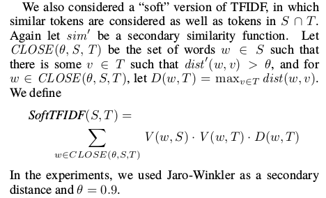

# soft-tfidf
Mispelling tolerant tf-idf similarity metric

Part of the [Dedupe.io](https://dedupe.io/) cloud service and open source toolset for de-duplicating and finding fuzzy matches in your data.

## Prior art
- https://github.com/openvenues/lieu/blob/8299d499186720c759331dca025c172214708fc0/lib/lieu/similarity.py#L13
- [A Comparison of String Distance Metrics for Name-Matching Tasks](https://web.archive.org/web/20150706104118/https://www.cs.cmu.edu/~pradeepr/papers/ijcai03.pdf)
- https://github.com/TeamCohen/secondstring
- https://github.com/anhaidgroup/py_stringmatching/blob/master/py_stringmatching/similarity_measure/soft_tfidf.py
- [Robust similarity measures for named entities matching](https://hal.archives-ouvertes.fr/hal-00487084/document)
- https://github.com/chrismattmann/tika-similarity/blob/980855b225856712cc07b7e7830df80225779a9f/metalevenshtein.py
- https://nlp.cic.ipn.mx/Publications/2011/SC%20spectra%20-%20soft%20cardinality%20for%20text%20comparison.pdf
- http://www.scielo.org.mx/pdf/cys/v18n3/v18n3a7.pdf

## Original Definition

 
 In this definition from ["A Comparison of String Distance Metrics for Name-Matching Tasks"](https://web.archive.org/web/20150706104118/https://www.cs.cmu.edu/~pradeepr/papers/ijcai03.pdf), I believe that "dist'(w,v) > θ" was meant to be "sim'(w,v) > θ".
 
 ## Questions
1.  I don't see any necessity for the measure that defines closeness to be the same measure used in D. If that's true, the performance of this measure could be dramatically improved by using an data structure to quickly find strings that are within some levenshtein distance from the target string. Something like Levenshtein_search
2. When calculating token frequency and inverse document frequency, do you count each individual string or try to collapse strings?
For example, if Illinois appears in 20 documents and Ilinois appears in 5 documents, shoudl we try to combine these into document frequency of 25 (or something like that)?
3. When calculating overlapping sets, what do we do with similar tokens that appear in the same document. What if Illinois and Ilinois appear in same document?
4. How sensitive is performance to the choice of D?
5. What is the justification for having the D term? If dist is the probability that w and v were supposed to be the same token, I could see a reason. But in that case, truncating at θ would not be principled, though that's likely true for any meaning of dist.
